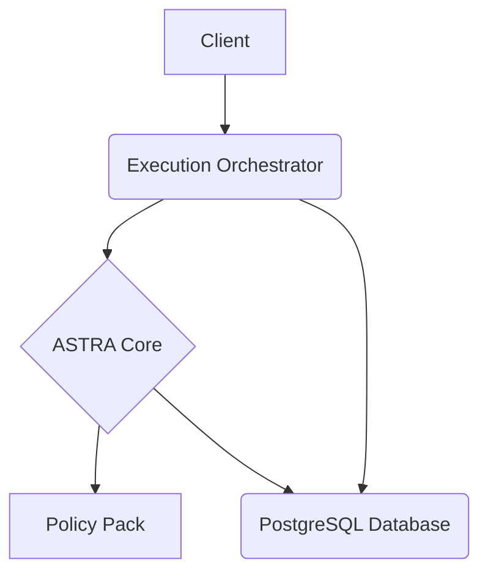

# ASTRA TAWZEEF - Comprehensive Technical Documentation

This document provides a comprehensive technical overview of the ASTRA TAWZEEF production system, including the CI/CD guardrails, EWOA fire drill, and all related components.

## 1. System Architecture

The ASTRA TAWZEEF system is a microservices-based architecture designed for low-latency, policy-driven authorization and execution. The system is composed of the following core services:

- **ASTRA Core:** The central decision engine that evaluates requests against a defined policy pack.
- **Execution Orchestrator:** The entry point for all requests, which orchestrates the interaction between the client, ASTRA Core, and the database.
- **Watcher Chair:** A service responsible for observing and recording events (not fully implemented in this version).
- **PostgreSQL Database:** The data store for all decision artifacts, execution records, and watcher observations.

The services are containerized using Docker and deployed using Docker Compose.

### 1.1. Architecture Diagram



## 2. CI/CD Guardrails

The CI/CD guardrail system is implemented as a set of GitHub Actions workflows that are triggered on every push to the `main` branch. The system is designed to ensure the stability and reliability of the production environment by automatically preventing deployments that violate the defined Service Level Agreements (SLAs).

### 2.1. `ci-guardrails.yml` Workflow

This workflow is the primary CI/CD pipeline for the ASTRA TAWZEEF system. It performs the following steps:

1.  **Static Code Analysis:** A placeholder for a static analysis tool to scan the code for potential issues.
2.  **Service Deployment:** The ASTRA TAWZEEF services are deployed to a clean environment using `docker-compose up -d`.
3.  **Latency Load Testing:** A latency load test is performed using k6 to measure the p95 latency of the system. The test script is embedded in the workflow file.
4.  **SLA Violation Check:** The p95 latency is compared against the defined SLA of 100ms. If the latency exceeds the SLA, the deployment is blocked.
5.  **NCR/CAPA Generation:** In the event of an SLA violation, a Non-Conformance Report (NCR) and a Corrective and Preventive Action (CAPA) report are automatically generated and committed to the repository.

### 2.2. `ewoa_fire_drill.yml` Workflow

This workflow is designed to validate the failure detection and response mechanisms of the CI/CD guardrail system. The fire drill simulates a production incident by intentionally introducing a latency regression into the system.

1.  **Baseline Test:** A baseline k6 load test is executed to establish the normal performance of the system.
2.  **Overload Test:** An overload k6 load test is executed to simulate a production incident and trigger the latency SLA violation.
3.  **NCR/CAPA Generation:** If the overload test triggers an SLA violation, the workflow generates and commits NCR and CAPA reports.
4.  **Chaos Tests:** A series of chaos tests are performed to validate the resilience of the system to various failure modes (not fully implemented in this version).

## 3. ASTRA Services

### 3.1. ASTRA Core

-   **File:** `services/astra_core/main.py`
-   **Purpose:** The central decision engine that evaluates requests against a defined policy pack.
-   **Endpoint:** `POST /v1/astra/authority/check`
-   **Policy Pack:** `services/astra_core/policy_pack.json`

#### `policy_pack.json`

```json
{
  "version": "1.0.0",
  "domains": {
    "interview": {
      "actions": {
        "start": {
          "allow_roles": ["recruiter", "system"],
          "requires": ["consent"]
        },
        "terminate": {
          "allow_roles": ["recruiter", "system", "astra"],
          "requires": ["consent"]
        }
      }
    },
    "watcher": {
      "actions": {
        "submit": {
          "allow_roles": ["watcher"],
          "requires": ["delegation_token"]
        }
      }
    }
  }
}
```

### 3.2. Execution Orchestrator

-   **File:** `services/execution_orchestrator/main.py`
-   **Purpose:** The entry point for all requests, which orchestrates the interaction between the client, ASTRA Core, and the database.
-   **Endpoint:** `POST /v2/orchestrator/execute`

### 3.3. Watcher Chair

-   **File:** `services/watcher_chair/main.py`
-   **Purpose:** A service responsible for observing and recording events (not fully implemented in this version).
-   **Endpoint:** `POST /v2/watcher/submit`

## 4. k6 Load Testing

### 4.1. Baseline Test

-   **File:** `tests/ewoa/01_k6_baseline.js`

```javascript
import http from 'k6/http';
import { check, sleep } from 'k6';
import { Rate, Trend } from 'k6/metrics';

const errorRate = new Rate('errors');
const executionLatency = new Trend('execution_latency');

export const options = {
  stages: [
    { duration: '30s', target: 2 },
    { duration: '2m', target: 2 },
    { duration: '30s', target: 0 },
  ],
  thresholds: {
    'http_req_duration': ['p(95)<100'],
    'errors': ['rate<0.1'],
  },
};

function generateUUID() {
  return 'xxxxxxxx-xxxx-4xxx-yxxx-xxxxxxxxxxxx'.replace(/[xy]/g, function(c) {
    const r = Math.random() * 16 | 0;
    const v = c === 'x' ? r : (r & 0x3 | 0x8);
    return v.toString(16);
  });
}

export default function () {
  const url = 'http://orchestrator:8001/v2/orchestrator/execute';
  
  const payload = JSON.stringify({
    request_id: generateUUID(),
    actor: {
      id: `test_user_${__VU}`,
      role: 'recruiter'
    },
    context: {
      domain: 'interview',
      action: 'start',
      consent: true
    }
  });
  
  const params = {
    headers: {
      'Content-Type': 'application/json',
    },
  };
  
  const startTime = Date.now();
  const response = http.post(url, payload, params);
  const endTime = Date.now();
  
  executionLatency.add(endTime - startTime);
  
  const success = check(response, {
    'status is 200': (r) => r.status === 200,
    'response has execution_id': (r) => {
      try {
        const body = JSON.parse(r.body);
        const hasExecutionId = body.execution_id !== undefined;
        if (!hasExecutionId) {
          console.log(`Response missing execution_id. Body: ${r.body}`);
        }
        return hasExecutionId;
      } catch (e) {
        console.log(`Invalid JSON response body: ${r.body}`);
        return false;
      }
    },
  });
  
  errorRate.add(!success);
  
  sleep(1);
}
```

### 4.2. Overload Test

-   **File:** `tests/ewoa/02_k6_overload.js`

```javascript
import http from 'k6/http';
import { check, sleep } from 'k6';
import { Rate, Trend, Counter } from 'k6/metrics';

const errorRate = new Rate('errors');
const executionLatency = new Trend('execution_latency');
const denialCount = new Counter('denials');
const timeoutCount = new Counter('timeouts');

export const options = {
  stages: [
    { duration: '30s', target: 10 },
    { duration: '1m', target: 50 },
    { duration: '1m', target: 50 },
    { duration: '30s', target: 0 },
  ],
  thresholds: {
    'http_req_duration': ['p(95)<500'],
    'errors': ['rate<0.3'],
  },
};

function generateUUID() {
  return 'xxxxxxxx-xxxx-4xxx-yxxx-xxxxxxxxxxxx'.replace(/[xy]/g, function(c) {
    const r = Math.random() * 16 | 0;
    const v = c === 'x' ? r : (r & 0x3 | 0x8);
    return v.toString(16);
  });
}

export default function () {
  const url = 'http://orchestrator:8001/v2/orchestrator/execute';
  
  const payload = JSON.stringify({
    request_id: generateUUID(),
    actor: {
      id: `overload_user_${__VU}_${__ITER}`,
      role: 'recruiter'
    },
    context: {
      domain: 'interview',
      action: 'start',
      consent: true
    }
  });
  
  const params = {
    headers: {
      'Content-Type': 'application/json',
    },
    timeout: '10s',
  };
  
  const startTime = Date.now();
  const response = http.post(url, payload, params);
  const endTime = Date.now();
  
  executionLatency.add(endTime - startTime);
  
  const success = check(response, {
    'status is 200 or 503': (r) => r.status === 200 || r.status === 503,
    'no 500 errors': (r) => r.status !== 500,
  });
  
  if (response.status === 503) {
    denialCount.add(1);
  }
  
  if (response.status === 0) {
    timeoutCount.add(1);
  }
  
  errorRate.add(!success);
  
  sleep(0.1);
}
```

## 5. Database Schema

-   **File:** `migrations/001_ddl_v2.sql`

```sql
CREATE TABLE IF NOT EXISTS astra_decision_artifacts (
    id UUID PRIMARY KEY DEFAULT gen_random_uuid(),
    request_id UUID NOT NULL,
    actor_id VARCHAR(255) NOT NULL,
    actor_role VARCHAR(255) NOT NULL,
    context_domain VARCHAR(255) NOT NULL,
    context_action VARCHAR(255) NOT NULL,
    outcome VARCHAR(255) NOT NULL,
    reason_code VARCHAR(255),
    created_at TIMESTAMPTZ NOT NULL DEFAULT NOW()
);

CREATE TABLE IF NOT EXISTS tawzeef_execution_artifacts (
    id UUID PRIMARY KEY DEFAULT gen_random_uuid(),
    decision_id UUID NOT NULL,
    request_id UUID NOT NULL,
    outcome VARCHAR(255) NOT NULL,
    created_at TIMESTAMPTZ NOT NULL DEFAULT NOW(),
    FOREIGN KEY (decision_id) REFERENCES astra_decision_artifacts(id)
);

CREATE TABLE IF NOT EXISTS tawzeef_watcher_artifacts (
    id UUID PRIMARY KEY DEFAULT gen_random_uuid(),
    request_id UUID NOT NULL,
    watcher_id VARCHAR(255) NOT NULL,
    payload JSONB NOT NULL,
    created_at TIMESTAMPTZ NOT NULL DEFAULT NOW()
);
```

## 6. NCR/CAPA Reports

-   **Location:** `09_Reports_and_Outputs/NCR_CAPA/`
-   **Generation:** Automatically generated by the `ci-guardrails.yml` and `ewoa_fire_drill.yml` workflows when an SLA violation is detected.

## 7. How to Run

### 7.1. Local Development

```bash
docker-compose up --build
```

### 7.2. EWOA Fire Drill

Navigate to the "Actions" tab in the GitHub repository, select the "EWOA Fire Drill" workflow, and click "Run workflow".

## 8. Troubleshooting

-   **EWOA Fire Drill Fails:** If the EWOA fire drill fails, check the logs of the workflow run to identify the failing step. The most common causes of failure are:
    -   Incorrect k6 script syntax
    -   Docker Compose configuration issues
    -   Service health check failures
-   **NCR/CAPA Reports Not Generated:** If the NCR/CAPA reports are not generated, check the logs of the `ci-guardrails.yml` or `ewoa_fire_drill.yml` workflow to ensure that the SLA violation was detected and that the report generation steps were executed.
